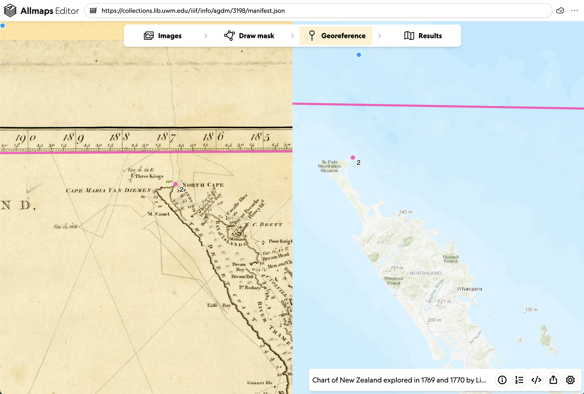
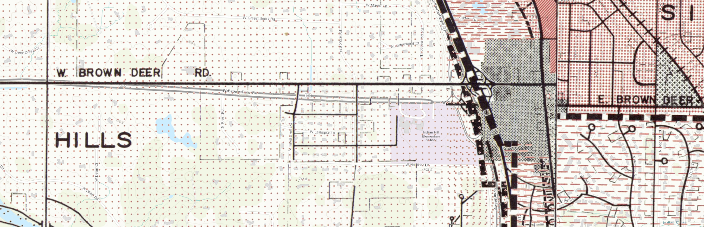
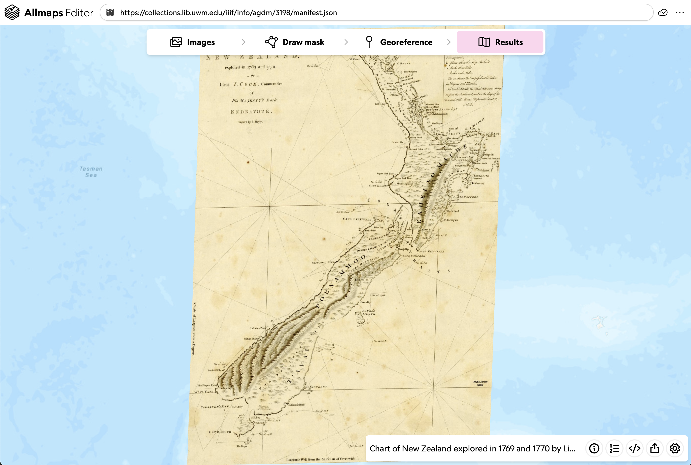

<link rel="stylesheet" href="assets/css/custom.css">

<a href="index.html" class="button">Back to Home</a>

  <a href="Georef-and-IIIF.html" class="button">Previous Lesson: Georeferencing in Allmaps</a>
  <a href="Viewer.html" class="button">Next Lesson: Doing More with Allmaps</a>

# Lesson 2: Georeferencing in Allmaps

In this lesson, we will actually get some hands-on experince georeferencing in Allmaps.

## Allmaps Editor

If you haven't already, launch the Allmaps editor by going to [editor.allmaps.org](https://editor.allmaps.org).

You can choose a map by either...

1. Enter a IIIF Manifest URL in the text box at the top of the page
2. Scroll down to find a map in one of the highlighted collections. 

## Masking

The first step is adding a clipping mask.
This involves drawing a line around the "map" areas of the document to exclude the map collar.
In other words, it's identifying the part of the scanned image that we want to georeference.

Use the Draw Mask tab to add a mask. Click to add points and double click to end the polygon.
If you mess up, click cancel to start over.

It's possible your map image includes multiple maps! Each map will get it's own mask!

 ([img src](https://iiif.io/api/extension/georef/images/greenpoint.jpg))

Much of the time, your mask will be one rectangle just inside the neatline.

## Ground Control Points

Ground control points (GCPs) guide Allmaps in aligning the scanned map on the left side of the screen with the real-world geography on the right side.

We will create GCPs in the Georeference tab.

To create a GCP, find a location that clearly matches on both sides—like an unchanged street intersection or the corner of a lasting building. Click that same spot on both sides of the editor.

### GCP Best Practices for Urban Atlases:

**Avoid water bodies**—they change too much over time to trust for georeferencing

**Roads and buildings are useful**—as long as roads and buildings haven't been torn down or paved over, 
these are your safest bet for identifying a shared location between past and present

**Check your progress**—sometimes it only takes a few points to successfully georeference a map. 
Furthermore, adding too many points can actually create undesirable distortions in the warped image. 
As you georeference your map, check your progress along the way 
(for example, maybe at 5 GCPs and again at 10 GCPs)

([Source](https://cartinal.leventhalmap.org/guides/georeferencing-with-allmaps.html#best-practices-for-creating-gcps))

Remember that things change! Roads are repositioned, water levels rise and fall, buildings are built and demolished. 
While georeferencing some maps that we will see in a later example, I found that perhaps using Brown Deer Road isn't the best option:

### What is this doing?

Behind the scenes, creating ground control points in Allmaps is creating a [Georeference Annotation](https://iiif.io/api/extension/georef/).

It creates paired values of resource coordinates and geometry coordinates. The Resource Coordinates reprsent pixels in the image (e.g. 3017 across, 4367 down) and the Geometry coordinates are longitude and latitude coordinates (e.g. 172.936215°E, 43.7589394°S).

Allmaps uses this annotation information to calculate how to display (including any warping and stretching) necessary to overlay the iamge on the map.

## Results

The results tab will show you a quick preview of the map you've been working on. This is a great way to check that you're in the right ballpark! Not all the features of Allmaps Viewers are available in the Results view, we will look at these functionalities in the next lesson.

On the bottom right, you will see a drawer with a few more tools:

The information button will open up a drawer with information about the IIIF resource that you're working on.

The GCP list will show you each of the resource-coordinate pairs you created. This is where you can delete GCPs if you are unhappy with them or feel like they aren't improving your georeference.

The code button will show you the actual JSON text of the Georeference Annotation as it's being created. You could actually copy and save this whole annotation and view it in allmaps viewer. It will be protected from anyone else making modifications this way!

The share button will give us some links for viewing the map in Allmaps Viewer, sharing the georeference annotation, sharing a GeoJSON representation of the georeferenced map, and finally the XYZ map tile link to use the map in an external webmap or even in GIS software.

We will be working in Allmaps Viewer for the next portion, so try visiting the "View in Allmaps Viewer" link in the share menu.

* * *

  <a href="Georef-and-IIIF.html" class="button">Previous Lesson: Georeferencing in Allmaps</a>
  <a href="Viewer.html" class="button">Next Lesson: Doing More with Allmaps</a>

<a href="index.html" class="button">Back to Home</a>

