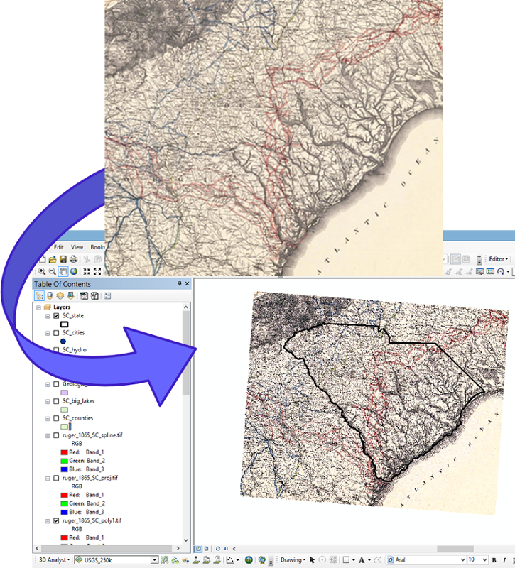
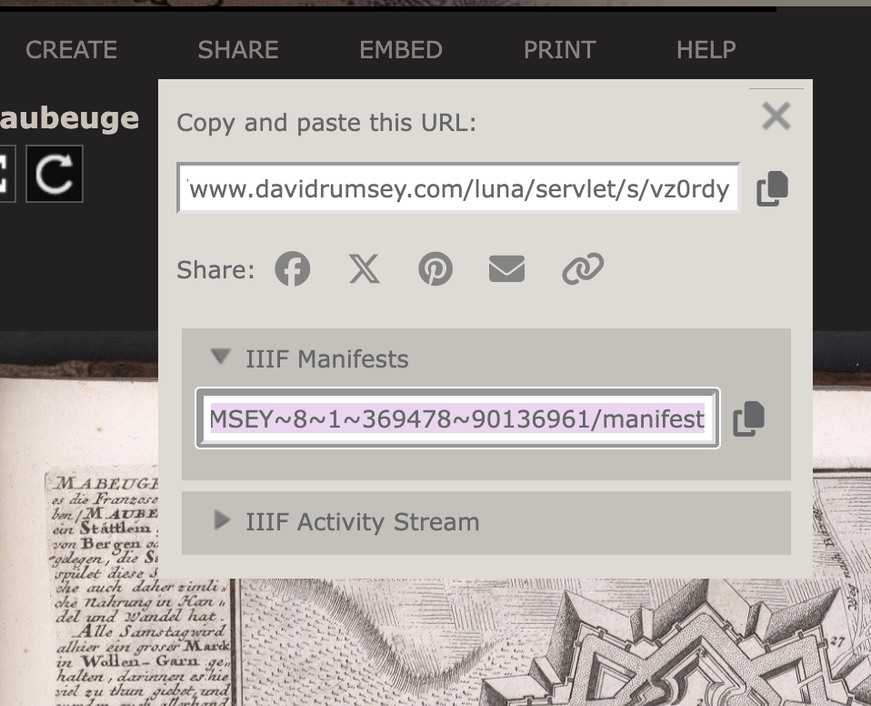

# Georeferencing and IIIF

## [here.allmaps.org](here.allmaps.org)

Go to [here.allmaps.org](here.allmaps.org) in your browser and, if prompted, allow the website to access your location.

The maps returned are maps that have been Georeferenced using the Allmaps platform. They're all maps held in digital collections, for example
the [AGSL Digital Map Collection](https://uwm.edu/lib-collections/agsl-digital-map-collection/).
In fact, any map in our collection can be used.
Furthermore, maps from any collection that uses IIIF, the International Image Interoperability Framework.

## Georeferencing

### What is Georeferencing?

[Georeferencing](https://en.wikipedia.org/wiki/Georeferencing) is the process of overlaying a digital image on a map by matching pixels on the image to real geographic locations. This is commonly done with aerial and satellite photography to transform photographs into usable spatial data.

The AGSL uses Georeferencing of aerial photography in our 
[Operation Birds Eye](https://uwm.maps.arcgis.com/apps/webappviewer/index.html?id=4e066bb8e5664d189ac3e77c26d21712)
discovery application. 
While anyone is welcome to flip through the nearly 300 photographs that make up this collection,
seeing them overlaid over modern satellite imagery adds additional context and the ability to make comparison over time.

Georeferencing scanned maps enables some useful analysis methods:
One can extract information from a map, such as locations of topographic features like villages, mountains, rivers, or roads.
Overlaid on top of one-another, two maps can be directly compared or verified.
And for large sets of maps that use many sheets to cover a geographic area, georeferencing can help create a *mosaic* for viewing
multiple sheets at once.

The example below shows the South Carolina state line being overlaid on a historic map in GIS, a basic yet useful function made possible by georeferencing.

*The georeferencing process to place a digital image into a GIS* ([Source for image and caption.](https://gistbok-ltb.ucgis.org/page/27/concept/8131))

Traditionally, georeferencing has been done with GIS--Geographic Information Systems.
With the proliferation of accessible and easy-to-use web mapping and GIS technology, 
products like Allmaps make the processes possible for non-experts in a browser environment.

There's a lot more that can be said about Georeferencing, but this is enough to get started!
For much more information, I recommend [*Georeferencing and Georectification*](https://gistbok-topics.ucgis.org/DC-01-030) in the GIS&T Body of Knowledge.

## What is IIIF?

IIIF (pronounced “triple-eye-eff”), or the [International Image Interoperability Framework](https://iiif.io/), 
is a set of open standards for delivering high-quality, attributed digital objects online at scale. 
IIIF is a way to standardize the delivery of images and audio/visual files from servers to different 
environments on the Web where they can then be viewed and interacted with in many ways.
([source](https://iiif.io/get-started/how-iiif-works/)) 

### Finding IIIF maps to use in Allmaps

Allmaps works best with large geographic scale, such as maps of neighborhoods, cities, states, or countries. While you can georeference small scale maps like world maps, the distortion that can be introduced by the georeferencing process can make them harder, not easier, to work with.
Allmaps excels at georeferencing city atlases containing multiple sheets collectively covering an area. 

Any map that is hosted using IIIF will work in Allmaps.
The IIIF consortium lists some collections [at this link](https://iiif.io/guides/finding_resources/). Note some very well known map collections including the [Library of Congress](https://www.loc.gov/maps) and [The David Rumsey Map Collection](https://www.davidrumsey.com/luna/servlet/view/all).

If you launch the Allmaps Editor [(editor.allmaps.org)](https://editor.allmaps.org), some maps hosted by some Allmaps partners (including the AGSL) that are waiting to be georeferenced are displayed.

If you're on the [AGSL Digital Map Collection](https://uwm.edu/lib-collections/agsl-digital-map-collection/) site and have a particular map you would like to georefernece, you need to find its IIIF Manifest URL. 
You can find this at the bottom of the page of any object. 

Other websites may require a bit more sluthing to find the URL. On the David Rumsey Collection you will find the URL under the share menu. Other websites may not expose their manifest URLs at all, but you can use tools like the [DetectIIIF browser](https://seige.digital/en/detektiiif/) extension to help.

[Back to homepage](/index.md) | [Next Lesson: Georeferencing in Allmaps](/Allmaps.md)
