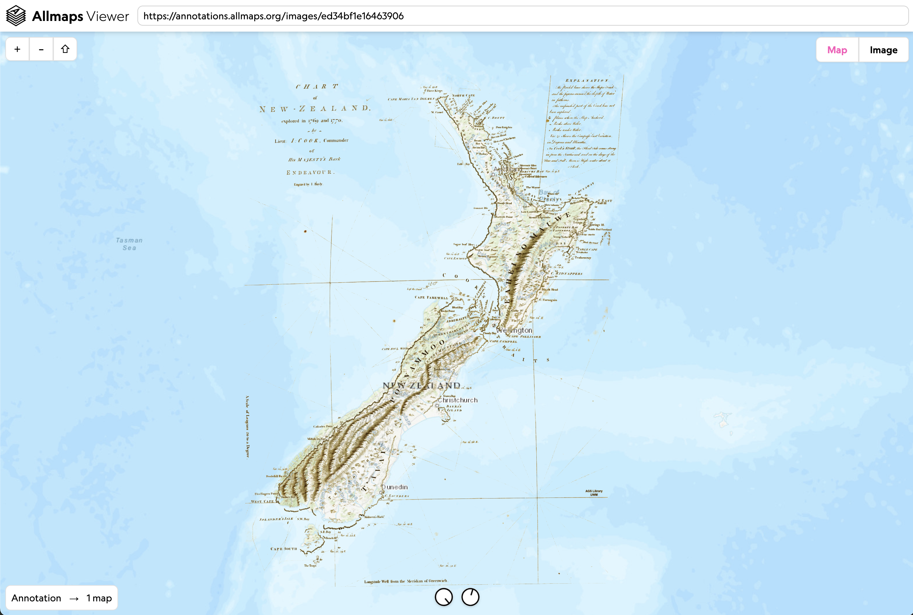
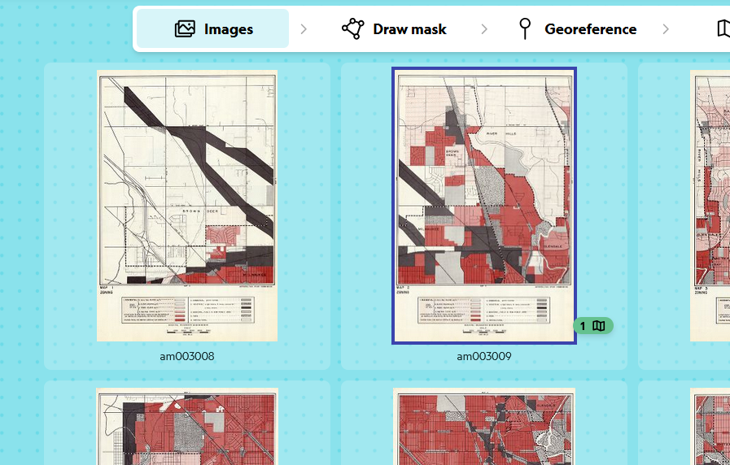
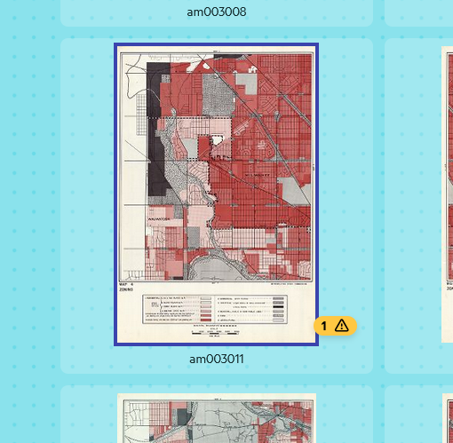
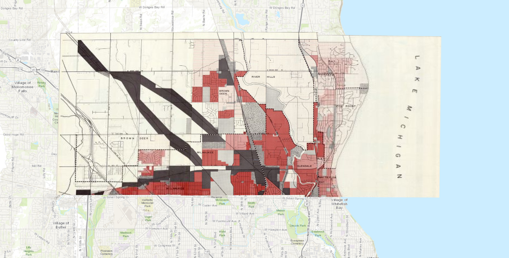
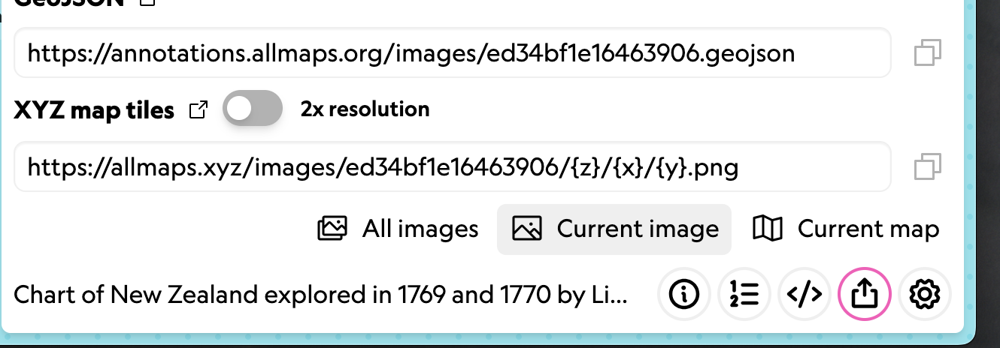

# Doing more with Allmaps

## Allmaps Viewer

[Allmaps Viewer](https://viewer.allmaps.org) is used for viewing georeferenced maps in Allmaps. Similar to the results tab of editor, you can view the map overlaid on a web map.
Viewer has a vew more tools that you can use to change the appearance and functionality of the map.

The most common tools are on the bottom of the page and look like small dials. They control layer transparency/opacity and background removal.

Background Removal is particularly useful with historical maps because it allows us to overlay the map data while not showing the blank space on the paper.

Other functionalities and keyboard shortcuts include:

- Toggle transparency on and off with `Space`
- Toggle background removal with `B`
- Display the mask with the `M`
- Change the transformation algorithm with `T`
- Display a grid over the image with `G`
- Use `D` to cycle display of distortions: surface deformation, angle distortion, or no distortion.

## Viewing stitched atlas sheets

I've been working on this [Milwaukee County land use and zoning atlas](https://collections.lib.uwm.edu/digital/collection/agdm/id/36112). 

The IIIF manifest is: `https://collections.lib.uwm.edu/iiif/info/agdm/36112/manifest.json`

You can see if a map in a set has already been georeferenced by looking for the green symbol:

And if someone has already created a mask but hasn't started Georeferencing, it will show a yellow warning:

[Viewing the manifest in Allmaps Viewer](https://viewer.allmaps.org/?url=https%3A%2F%2Fcollections.lib.uwm.edu%2Fiiif%2Finfo%2Fagdm%2F36112%2Fmanifest.json), you can see the pages stitched together. As we continue to work through this atlas, additional sheets will be visible.

For objects with multiple maps:

- `[` and `]` keys cycle through the different maps
- `right click` on a map to adjust the order of the map layers

## Changing Transformation Algorithm

As we learned, ground control points (GCPs) are defined locations where known features are matched with already-georeferenced data (like a basemap.)

From there, the warping of the image is done via an algorithm to extrapolate the GCPs to the entire image.

There are numerous transformation algorithms and we may see different results depending on the algorithm we use. Some will introduce more distortion to the image, making it appear stretched and distroted. This is commonly called "rubber sheeting". 

You cycle through the transformation algorithms with `T`.

## XYZ Tiles in GIS

Allmaps hosts a free XYZ tile server so you can quickly use your Allmaps-georeferenced maps in GIS.
A word of warning, the Allmaps tile server is not a long term hosting solution.

In the free and open source QGIS, you can use the `Add XYZ Layer` tool to add your map to your project.

From the Allmaps Editor share tools, grab the XYZ Tile URL.

Then add a new XYZ Connection in QGIS, pasting the URL into the tool. Usually no other changes are necessary.

Now you can use your georeferenced map right in Desktop GIS!

From here, you can even use the Export tool to save the dataset as a GeoTIFF, the most popular format for working with Georeferenced images in Desktop GIS.

There's an [observable notebook](https://observablehq.com/@allmaps/allmaps-tile-server) with more information bout the Allmaps Tile Server.

## More you can do

What will you do with maps georeferenced in Allmaps?

Here's just a few examples of some of the cool things that have been done!

- [Stories from urban atlases of Waltham](https://www.leventhalmap.org/articles/waltham-urban-atlas-essays/)
- [Atlascope](https://www.atlascope.org/)
- [Architectural Drawings](https://viewer.allmaps.org/?url=https%3A%2F%2Fsammeltassen.nl%2Fiiif-manifests%2Fallmaps%2Frivierahal-blijdorp.json)
- [Aerial Photographs](https://viewer.allmaps.org/?url=https%3A%2F%2Fannotations.allmaps.org%2Fimages%2F4bcc9463d2a68df4)

Another place to learn more about Allmaps is the collection of [Allmaps Observable Notebooks](https://observablehq.com/@allmaps).
Here you will find out how to do things like...

- Use IIIF maps in MapLibre, Leaflet, or OpenLayers
- Draw vector GeoJSON layers on top of Allmaps
- Georeference based on toponyms (placenames)
- Learn more about the code behind Allmaps and more!

