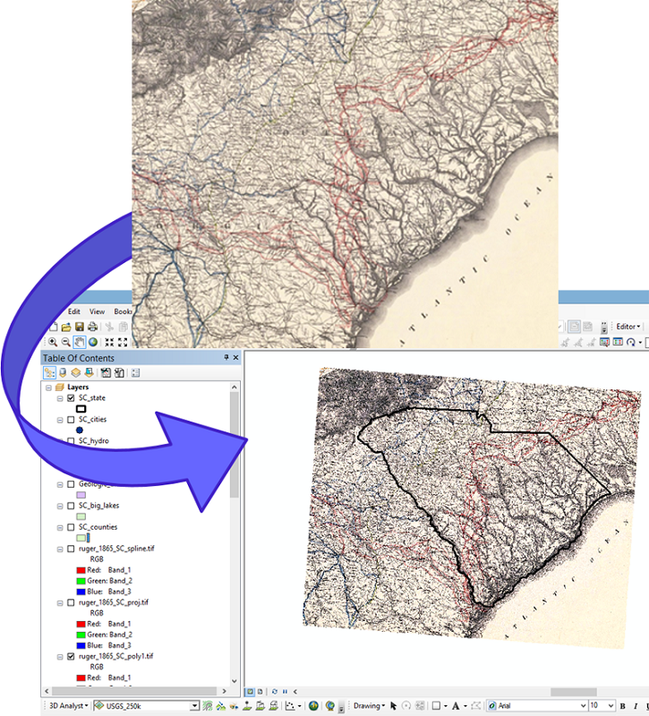

<link rel="stylesheet" href="assets/css/custom.css">

    <a href="index.html" class="button">Back to Home</a>
    <a href="Allmaps.html" class="button">Next Lesson: Georeferencing in Allmaps</a>

* * *

# Lesson 1: Georeferencing and IIIF

## [here.allmaps.org](https://here.allmaps.org)

Go to [here.allmaps.org](https://here.allmaps.org) in your browser and, if prompted, allow the website to access your location.

The maps returned are maps that have been **georeferenced** using the Allmaps platform. They're all maps held in digital collections—for example,
the [AGSL Digital Map Collection](https://uwm.edu/lib-collections/agsl-digital-map-collection/).
In fact, any map in our collection can be used, and so can maps from any collection that uses **IIIF**, the **International Image Interoperability Framework**.

## Georeferencing

### What is Georeferencing?

[Georeferencing](https://en.wikipedia.org/wiki/Georeferencing) is the process of overlaying a digital image on a map by matching pixels on the image to real geographic locations. This is commonly done with aerial and satellite photography to transform photographs into usable spatial data.

The AGSL uses georeferencing of aerial photography in our
[Operation Birds Eye](https://uwm.maps.arcgis.com/apps/webappviewer/index.html?id=4e066bb8e5664d189ac3e77c26d21712)
discovery application.
While anyone is welcome to flip through the nearly 300 photographs that make up this collection,
seeing them overlaid on modern satellite imagery adds valuable context and enables comparisons over time.

Georeferencing scanned maps enables powerful spatial analysis:
- Extract information from a map, such as locations of topographic features like villages, mountains, rivers, or roads.
- Compare or verify features by overlaying two maps.
- Create a *mosaic* for viewing multiple sheets at once in large map series.

*The georeferencing process to place a digital image into a GIS* ([source](https://gistbok-ltb.ucgis.org/page/27/concept/8131))

For objects with multiple sheets or pages—such as urban atlases—georeferencing can make the experience easier and more engaging.
We used georeferenced Sanborn Fire Insurance Maps to create our
[Sanborn Web Map](https://webgis.uwm.edu/agsl/sanborn/).
A similar project by the Leventhal Map & Education Center at the Boston Public Library (co-recipients of a NEH Digital Advancement Grant) used Allmaps
to georeference urban atlas sheets for their fantastic [Atlascope application](https://www.atlascope.org/).

Traditionally, georeferencing has been done in **GIS** (Geographic Information Systems).
Thanks to modern, accessible web-mapping tools, platforms like **Allmaps** now make this process possible for non-experts—right in the browser.

For more detailed background, see [*Georeferencing and Georectification*](https://gistbok-topics.ucgis.org/DC-01-030) in the GIS&T Body of Knowledge.

## What is IIIF?

**IIIF** (pronounced "triple-eye-eff"), or the [International Image Interoperability Framework](https://iiif.io/),
is a set of open standards for delivering high-quality, attributed digital objects online at scale.

IIIF provides a consistent way for institutions to share digital images, maps, manuscripts, artworks, and even audio/visual files across different platforms.
Rather than locking media inside specific viewers or software tools, IIIF offers a **standardized, flexible way** to deliver these resources to any compatible application.

This means that:

- A digitized map from one library can be viewed side-by-side with one from another institution.
- A scholar can annotate or compare high-resolution images without downloading large files.
- Tools like [Allmaps](https://allmaps.org/), [Mirador](https://projectmirador.org/), and [Universal Viewer](https://universalviewer.io/) can all read the same IIIF content.

At its core, IIIF enables **interoperability**—making it easier for cultural heritage institutions, educators, and developers to **build rich user experiences around media** from all over the world.

Learn more at [iiif.io](https://iiif.io/get-started/how-iiif-works/). ([source](https://iiif.io/get-started/how-iiif-works/))

Take a look at the AGSL's treasured [Leardo Mappamundi](https://collections.lib.uwm.edu/digital/collection/agdm/id/538/).
Clicking on the expand arrows allows us to view the map in stunning detail directly in the browser—no need to download huge image files.
But beyond making images zoomable, IIIF enables much more...

### Finding IIIF maps to use in Allmaps

**Allmaps** works best with large-scale maps—such as city, county, state, or country maps.
While it’s possible to georeference small-scale maps (like world maps), distortion introduced by the georeferencing process—especially in **Web Mercator**—can make them harder to work with.

Allmaps excels at georeferencing:
- City atlases
- County and state maps
- Topographic or thematic map series

Any map hosted using IIIF will work in Allmaps.
The IIIF Consortium lists some collections at [this link](https://iiif.io/guides/finding_resources/), including:
- [Library of Congress](https://www.loc.gov/maps)
- [The David Rumsey Map Collection](https://www.davidrumsey.com/luna/servlet/view/all)

If you launch the [Allmaps Editor](https://editor.allmaps.org), you'll see maps hosted by various Allmaps partners (including AGSL) that are waiting to be georeferenced.

To georeference a specific map from the [AGSL Digital Map Collection](https://uwm.edu/lib-collections/agsl-digital-map-collection/),
you'll need to find its **IIIF Manifest URL**—located at the bottom of each item page.

Other websites may require more sleuthing to find the manifest.
On the David Rumsey Collection, it's listed under the **share** menu.
If it’s not visible, tools like the [DetectIIIF browser extension](https://seige.digital/en/detektiiif/) can help.

* * *

    <a href="index.html" class="button">Back to Home</a>
    <a href="Allmaps.html" class="button">Next Lesson: Georeferencing in Allmaps</a>

